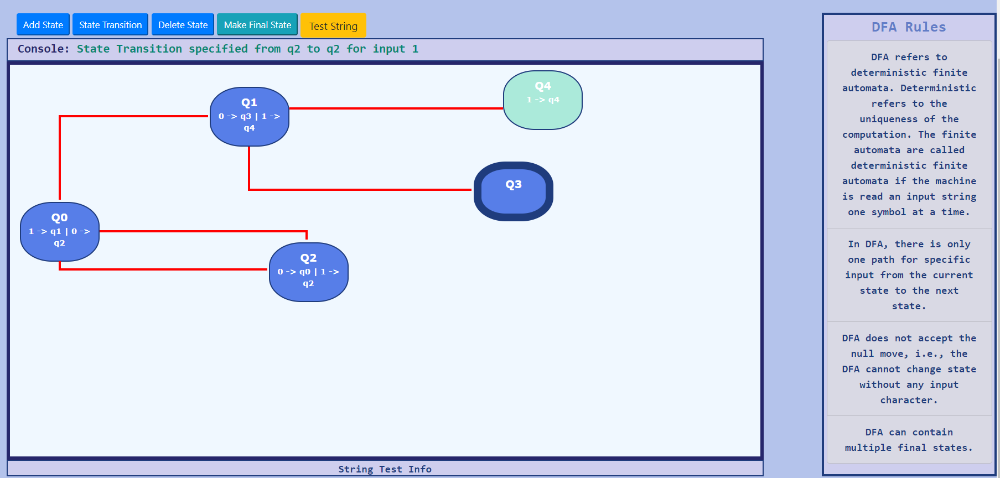
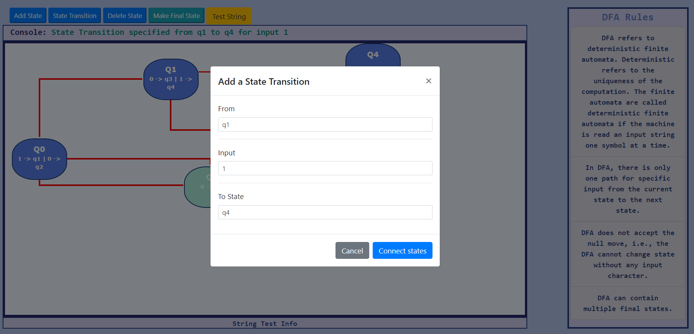

<h3><b> Deterministic Finite Machine Simulator</b></h3>
<h5> <i>Build and test DFAs </i> </h5>

<h4> Description: </h4>

 Finite Automata(FA) is the simplest machine to recognize patterns. DFA refers to deterministic finite automata. Deterministic refers to the uniqueness of the computation. The finite automata are called deterministic finite automata if the machine is read an input string one symbol at a time.

<h4> Rules for Creating A DFA </h4>
 <ul>
            <li>
              DFA refers to deterministic finite automata. Deterministic refers
              to the uniqueness of the computation. The finite automata are
              called deterministic finite automata if the machine is read an
              input string one symbol at a time.
            </li>
            <li>
              In DFA, there is only one path for specific input from the current
              state to the next state.
            </li>
            <li>
              DFA does not accept the null move, i.e., the DFA cannot change
              state without any input character.
            </li>
            <li>
              DFA can contain multiple final states.
            </li>
          </ul>

This is a software which lets you build DFA diagrams on a drawing area and test it with custom input strings.

  

<h4> Run:  </h4>
<ul>
<li> Clone this repositor and open index.html </li>
<li> Press Add new state button and drag the button to your required position.  Connect states using state transition button. A form will appear which will require inputs such as the image shown below.</li>
   

<li> Specify the Input and the states which are to be connected.</li>
<li> After the diagram is complete, press Test string button (make sure you have specified a final state)</li>
<li> Enter an input string. Make sure the chars in the string are the same as the inputs taken for state transitions and Run</li>
</ul>

<h3>Contribution</h3>

 During the project developement, my focus was on JavaScirpt, and the UI was completely neglected (as you can see). This web app can use a better interface. If you face any bugs report issue accordingly.  
